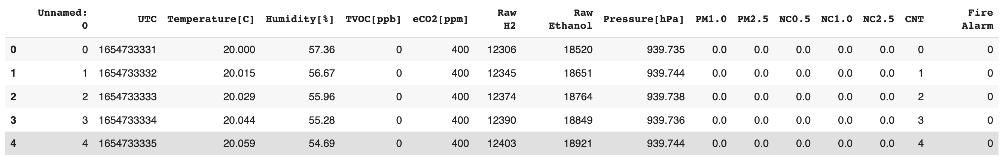
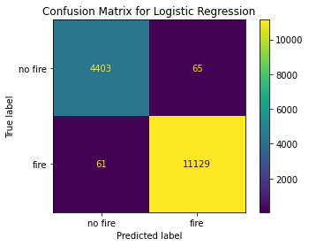

# Smoke_Detection
Predicted the detection of smoke by applying logistic regression (99.2% accuracy)

## Overivew 

A [dataset](https://www.kaggle.com/datasets/deepcontractor/smoke-detection-dataset) on Kaggle contains chemical data from the air that was measured by a near-by smoke detector. Using this data, the alarm of the detector would decid whether to initiate or not. This project applies a logistical regression model to predict whether the alarm goes off (presense of fire) or does not go off (absense of fire). 

Data as a Pandas dataframe: 

Each variables was used as a feature except for the timestamp. The model used "liblinear" as the solver. The data was split between 75% for training and 25% for testing, which is the default for this model.

## Results

The results were excellent. Of the 15,658+ samples, only 126 were classified incorrectly, which is an accuracy of 99.2%. The F1 scores for both classes were 0.99. The reason for these results lies in the fact that the dataset is 1) very large 2) contains several chemically relevant features 3) clean. 

